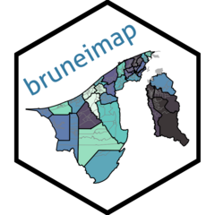

<!-- README.md is generated from README.Rmd. Please edit that file -->

```{r, include = FALSE}
knitr::opts_chunk$set(
  collapse = TRUE,
  comment = "#>",
  fig.path = "man/figures/README-",
  out.width = "100%"
)
```

# bruneimap <a href="https://bruneiverse.github.io/bruneimap/"></a>

<!-- badges: start -->
[](https://github.com/Bruneiverse/bruneimap/actions/workflows/R-CMD-check.yaml)
[](https://CRAN.R-project.org/package=bruneimap)
[](https://cran.r-project.org/package=bruneimap)
<!-- badges: end -->

Provides Brunei GIS data in the form of a `sf` (simple features) object ready for plotting and analysis in R. 
The smallest (areal) unit of analysis is a "kampong" (although not all areas are actual kampongs), which in turn is contained within mukims and districts.

## Installation

Install the released version of `{bruneimap}` from [CRAN](https://CRAN.R-project.org) with:

```r
install.packages("bruneimap")
```

Or, if preferred, you may install the development version from [GitHub](https://github.com/) using:

``` r
# install.packages("pak")
pak::pkg_install("propertypricebn/bruneimap")
```

## Features

There are three `sf` files contained in the package:

1. `dis_sf` (District level boundaries)
2. `mkm_sf` (Mukim level boundaries)
3. `kpg_sf` ("Kampong" level boundaries)

Most likely you will want to use either the kampong level or mukim level data.

### Data

```{r, message = FALSE}
# Load libraries
library(tidyverse)
theme_set(theme_bw())
library(bruneimap)
library(sf)

# What's in our data set?
glimpse(kpg_sf)
```

### Plots

```{r brunei_map_plot, message = FALSE, warning = FALSE}
ggplot(kpg_sf) +
  geom_sf(aes(fill = mukim), col = "gray50", alpha = 0.8) +
  geom_sf(data = mkm_sf, col = "black", lwd = 0.5, fill = NA) +
  geom_sf(data = dplyr::filter(kpg_sf, is.na(mukim)), fill = "gray70", col = "gray70") +
  theme(legend.position = "none") +
  scale_fill_viridis_d(option = "mako")
```


## Citation

To cite package `{bruneimap}` in publications use:

> Jamil, H (2024). _bruneimap: Maps and Spatial Data of Brunei (R
  package version 0.3.1.9001)_. https://bruneiverse.github.io/bruneimap/.

A BibTeX entry for LaTeX users is:

```bibtex
@Manual{,
    title = {bruneimap: {M}aps and {S}patial {D}ata of {B}runei ({R} package version 0.3.1.9001)},
    author = {Haziq Jamil},
    year = {2024},
    url = {https://bruneiverse.github.io/bruneimap/},
  }
```

## Data Sources

The GIS data included in this package is sourced sourced from [Nadi.BN](https://www.nadi.bn/data-catalogues/iot/datasets/brunei-map/#overview), licensed under [CC BY 4.0](https://creativecommons.org/licenses/by/4.0/).
Earlier versions of this package used GIS data obtained from the [Survey Department, Ministry of Development, Brunei Darussalam](https://geoportal.survey.gov.bn/start-gp). 
While this data formed the initial basis of the package, it has since been replaced with data from Nadi.BN to align with current licensing and usage terms.  

Special thanks to the creator of the [thewheat/brunei_map](https://github.com/thewheat/brunei_map) GitHub repository for their contributions, as well as the neat [web app](http://thewheat.github.io/brunei_map/) that inspired this work.

## License

The `{bruneimap}` package is licensed under the [GPL-3](https://www.gnu.org/licenses/gpl-3.0.en.html). 

```
bruneimap: Maps and Spatial Data of Brunei
Copyright (C) 2024- Haziq Jamil

This program is free software: you can redistribute it and/or modify
it under the terms of the GNU General Public License as published by
the Free Software Foundation, either version 3 of the License, or
(at your option) any later version.

This program is distributed in the hope that it will be useful,
but WITHOUT ANY WARRANTY; without even the implied warranty of
MERCHANTABILITY or FITNESS FOR A PARTICULAR PURPOSE.  See the
GNU General Public License for more details.

You should have received a copy of the GNU General Public License
along with this program.  If not, see <http://www.gnu.org/licenses/>.
```

By using this package, you agree to comply with both licenses: 
the GPL-3 license for the software and the CC BY 4.0 license for the data.

## Disclaimer

The data included in this package is provided "as is" and for research and visualisation purposes only. 
The package author(s) make no guarantees regarding the accuracy, completeness, or reliability of the data. 
Users are advised to consult authoritative sources for up-to-date information.
The author(s) of this package are not affiliated with Nadi.BN or any Brunei government entity.


## Contributors


<!-- ALL-CONTRIBUTORS-LIST:START - Do not remove or modify this section -->
<!-- prettier-ignore-start -->
<!-- markdownlint-disable -->

All contributions to this project are gratefully acknowledged using the [`allcontributors` package](https://github.com/ropensci/allcontributors) following the [all-contributors](https://allcontributors.org) specification. Contributions of any kind are welcome!

<table>

<tr>
<td align="center">
<a href="https://github.com/nrirdnbtrsy">

</a><br>
<a href="https://github.com/Bruneiverse/bruneimap/commits?author=nrirdnbtrsy">nrirdnbtrsy</a>
</td>
<td align="center">
<a href="https://github.com/haziqj">

</a><br>
<a href="https://github.com/Bruneiverse/bruneimap/commits?author=haziqj">haziqj</a>
</td>
<td align="center">
<a href="https://github.com/alvinbjl">

</a><br>
<a href="https://github.com/Bruneiverse/bruneimap/commits?author=alvinbjl">alvinbjl</a>
</td>
<td align="center">
<a href="https://github.com/Angela-29">

</a><br>
<a href="https://github.com/Bruneiverse/bruneimap/commits?author=Angela-29">Angela-29</a>
</td>
<td align="center">
<a href="https://github.com/SyafYus">

</a><br>
<a href="https://github.com/Bruneiverse/bruneimap/commits?author=SyafYus">SyafYus</a>
</td>
<td align="center">
<a href="https://github.com/Dwaaz">

</a><br>
<a href="https://github.com/Bruneiverse/bruneimap/commits?author=Dwaaz">Dwaaz</a>
</td>
<td align="center">
<a href="https://github.com/HafeezulRaziq">

</a><br>
<a href="https://github.com/Bruneiverse/bruneimap/commits?author=HafeezulRaziq">HafeezulRaziq</a>
</td>
</tr>


<tr>
<td align="center">
<a href="https://github.com/ANajwa-20">

</a><br>
<a href="https://github.com/Bruneiverse/bruneimap/commits?author=ANajwa-20">ANajwa-20</a>
</td>
<td align="center">
<a href="https://github.com/nswaaan">

</a><br>
<a href="https://github.com/Bruneiverse/bruneimap/commits?author=nswaaan">nswaaan</a>
</td>
<td align="center">
<a href="https://github.com/MrJaZzi">

</a><br>
<a href="https://github.com/Bruneiverse/bruneimap/commits?author=MrJaZzi">MrJaZzi</a>
</td>
<td align="center">
<a href="https://github.com/Syfii">

</a><br>
<a href="https://github.com/Bruneiverse/bruneimap/commits?author=Syfii">Syfii</a>
</td>
</tr>

</table>

<!-- markdownlint-enable -->
<!-- prettier-ignore-end -->
<!-- ALL-CONTRIBUTORS-LIST:END -->


