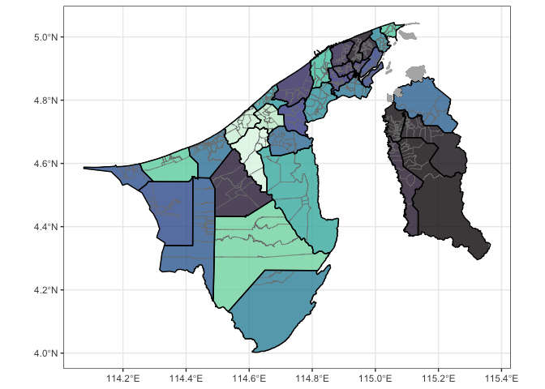

<!-- README.md is generated from README.Rmd. Please edit that file -->

# bruneimap

<!-- badges: start -->

[](https://github.com/propertypricebn/bruneimap/actions/workflows/R-CMD-check.yaml)
<!-- badges: end -->

Provides Brunei GIS data in the form of a `sf` (simple features) object
ready for plotting and analysis in R. The smallest (areal) unit of
analysis is a “kampong” (although not all areas are actual kampongs),
which in turn is contained within mukims and districts.

## Installation

You can install the development version of bruneimap from
[GitHub](https://github.com/) with:

``` r
# install.packages("pak")
pak::pkg_install("propertypricebn/bruneimap")
```

## Features

There are three `sf` files contained in the package:

1.  `dis_sf` (District level boundaries)
2.  `mkm_sf` (Mukim level boundaries)
3.  `kpg_sf` (“Kampong” level boundaries)

Most likely you will want to use either the kampong level or mukim level
data.

### Data

``` r
# Load libraries
library(tidyverse)
theme_set(theme_bw())
library(bruneimap)
library(sf)

# What's in our data set?
glimpse(kpg_sf)
#> Rows: 438
#> Columns: 9
#> $ id        <dbl> 1, 2, 3, 4, 5, 6, 7, 8, 9, 10, 11, 12, 13, 14, 15, 16, 17, 1…
#> $ kampong   <chr> "Kg. Biang", "Kg. Amo", "Kg. Sibut", "Kg. Sumbiling Baru", "…
#> $ mukim     <chr> "Mukim Amo", "Mukim Amo", "Mukim Amo", "Mukim Amo", "Mukim A…
#> $ district  <chr> "Temburong", "Temburong", "Temburong", "Temburong", "Temburo…
#> $ geometry  <POLYGON [°]> POLYGON ((115.1546 4.66665,..., POLYGON ((115.1626 4…
#> $ X         <dbl> 115.1244, 115.1512, 115.1080, 115.1071, 115.1600, 115.1247, …
#> $ Y         <dbl> 4.666180, 4.631506, 4.611763, 4.597677, 4.574173, 4.587969, …
#> $ perimeter [m] 21056.211 [m], 38683.611 [m], 16291.051 [m], 12994.328 [m], 33…
#> $ area      [m^2] 19281117.5 [m^2], 52037879.4 [m^2], 7597654.2 [m^2], 6652565…
```

### Plots

``` r
ggplot(kpg_sf) +
  geom_sf(aes(fill = mukim), col = "gray50") +
  geom_sf(data = mkm_sf, col = "black", lwd = 0.5, fill = NA) +
  geom_sf(data = filter(kpg_sf, is.na(mukim)), fill = "gray70", col = "gray70") +
  theme(legend.position = "none") +
  scale_fill_viridis_d(option = "turbo")
```



## Acknowledgements

- The Brunei map was generated from publically available [Survey
  Department](https://geoportal.survey.gov.bn/start-gp) data. The
  GeoJSON files were sourced from
  [thewheat/brunei_map](https://github.com/thewheat/brunei_map) GitHub
  repo. Comes with a neat [web
  app](http://thewheat.github.io/brunei_map/). Many thanks to these
  guys!
